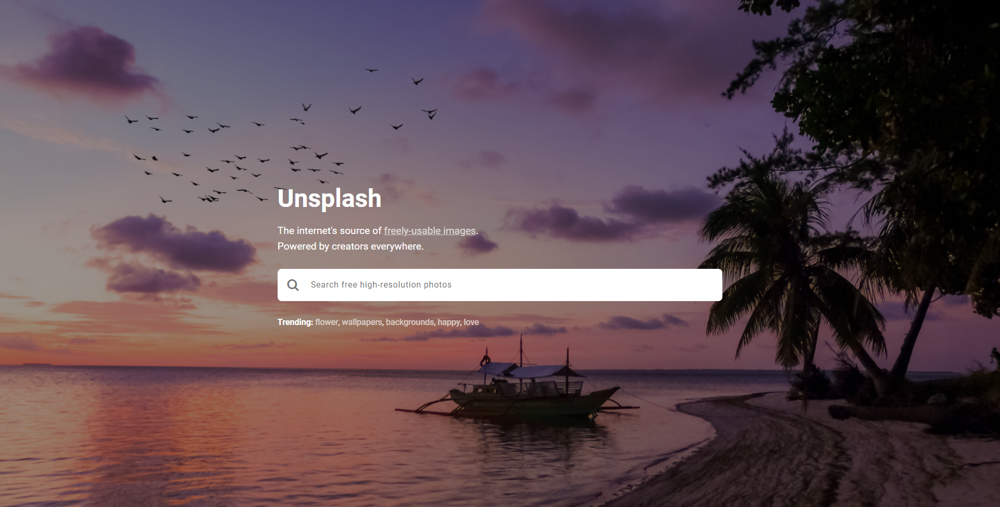

# Photo search app

App to searching and browsing photos available on Unsplash API.

## Table of contents

- [Live](#live)
- [Technologies](#technologies)
- [Setup](#setup)

## Live

[photo-search-app](https://kbuczynski.github.io/photo-search-app/)

## Technologies

Project is created with:

- React Hooks
- SASS

## Setup

This project was bootstrapped with [Create React App](https://github.com/facebook/create-react-app).
To run this project, install it locally using [npm](https://www.npmjs.com):

### Create your API key

Register on [unsplash.com/developers](https://unsplash.com/developers) then get your API key
Create ".env" file in main directory and create a variable called REACT_APP_API_KEY=YOUR_API_KEY

### Available Scripts

In the project directory, you can run:

```
$ npm i
```

Installs the necessary packages

```
$ npm start
```

Runs the app in the development mode.<br />
Open [http://localhost:3000](http://localhost:3000) to view it in the browser.
